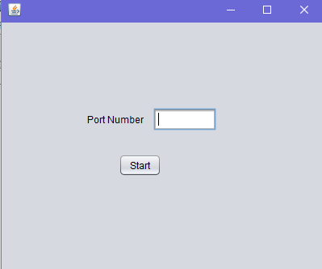
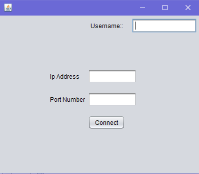

Project on File Sharing:-

[]
[]
[]

## It consist of
-   Authorized access to clients
-   Sorted files for files in directory :thumbsup: History (date, file shared , user detail)
-   Acception / rejection of connection
-   GUI
-   Multiple sharing of file
-   Sum up all and build it as one

## How to Run
**It would be better if install <a href="https://netbeans.org/">Netbeans</a>**

- Add path of File.log <a href="https://github.com/rockstar777/file_sharing/blob/8754661f547f8d5c4462213c6021762683f7646d/File_Sharing/Client_Main.java#L169">here</a>

-   First run Server_Main.java file you will see this window

    
    
    
-   Enter the Port number
-   Run the Client_Main.java you will see this window

    
    

-   Enter your name, Ip Address (If you are you running both client in your laptop then Ip Address (127.0.0.1) ), And Port number same as in server window
-   Your file_sharing is ready 

## Group member
 Avkaran Singh

 Puneet bindal

 Daksh Gondaliya

 Kanhaiya Lal

 Zahid Qureshi

Thank you

:heart: :heart: :heart:

 ** Java ** 

